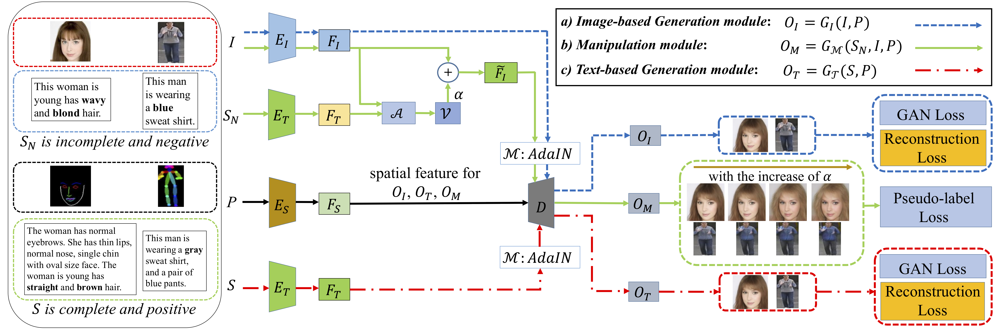
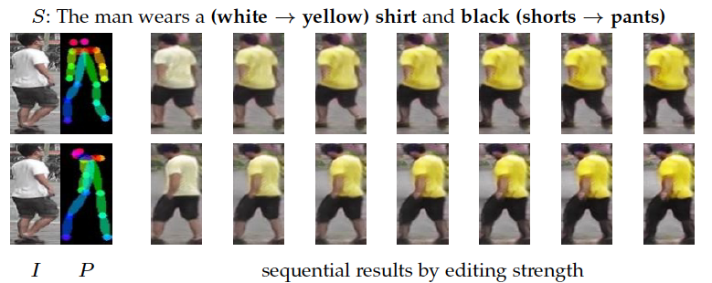

# Text-Guided Human Image Manipulation via Image-Text Shared Space

This is a pytorch project for the paper [**Text-Guided Human Image Manipulation via Image-Text Shared Space**] by Xiaogang Xu, Ying-cong Chen, Xin Tao, and Jiaya Jia presented at **TPAMI**.

## Introduction

Text is a new way to guide human image manipulation. Albeit natural and flexible, text usually suffers from inaccuracy in spatial description, ambiguity in the description of appearance, and incompleteness.
We in this paper address these issues. To overcome inaccuracy, we use structured information (e.g., poses) to help identify correct location to manipulate, by disentangling the control of appearance and spatial structure.
Moreover, we learn the image-text shared space with derived disentanglement to improve accuracy and quality of manipulation, by separating relevant and irrelevant editing directions for the textual instructions in this space.
Our model generates a series of manipulation results by moving source images in this space with different degrees of editing strength. Thus, to reduce the ambiguity in text, our model generates sequential output for manual selection.
In addition, we propose an efficient pseudo-label loss to enhance editing performance when the text is incomplete. We evaluate our method on various datasets and show its precision and interactiveness to manipulate human images.






## Project Outline

Here is how the project is arranged and developed:
- test_modify_adj: the script to manipulate images where the text is obtained by adjusting the adj. in language
- test_user_input: the script to manipulate images where the text is provided by users
- networks: Basic modules used in the model
- text_model: Basic modules used in the text encoder
- data_test_pose: the dataloader
- tester: the manipulation process
- utils_test: utility functions used in the project

## Project Setup

First install Python 3. We advise you to install Python 3 and PyTorch with Anaconda:

```
conda create --name py36 python=3.6
source activate py36
```

Clone the repo and install the complementary requirements:
```
cd $HOME
git clone --recursive git@github.com:xiaogang00/Text-Human-Image-Manipulation.git
cd Text-Human-Image-Manipulation
pip install -r requirements.txt
```

## Prepare dataset:
- Download CUHK-PEDES dataset, link: https://github.com/ShuangLI59/Person-Search-with-Natural-Language-Description. There should be imgs/ and caption_all.json.
- Use the openpose for pose detection, and obtain the pose of each image in imgs/. Place them in pose_imgs/ with the same directory structure of imgs/. You can download the pose information (we remove the image whose pose can not be accurately detected) from link: https://drive.google.com/file/d/1nd5QNLB586Qc4KCPMde954No88nbC-jX/view?usp=sharing.
- Modify the path of dataset in the config yaml.


## Usage

Download the pre-trained model from https://drive.google.com/file/d/1I7Ed_jFfIrGRtJbniSdsbBpkht78Ck1Q/view?usp=sharing, and place them in ./pretrain

To manipulate one image, we can modify the adjective in the corresponding paired sentence (the sentence is provided in the original dataset).

```
python test_modify_adj.py --config config/PEDES_modify_adj.yaml --checkpoint_path ./pretrain --output_path ./output
```

To manipulate one image, we can also create sentences by ourselves.

```
python test_user_input.py --config config/PEDES_user_input.yaml --checkpoint_path ./pretrain --output_path ./output
```

the manipulated image will be saved in ./output/sample, the input image will be saved in ./output/sample_real, the input pose will be saved in ./output/sample_pose, and the text information will be saved in ./output/sample_nlp

## Citation Information

If you find the project useful, please cite:

```
@article{xu2021text,
  title={Text-Guided Human Image Manipulation via Image-Text Shared Space},
  author={Xu, Xiaogang and Chen, Yingcong and Tao, Xin and Jia, Jiaya},
  journal={TPAMI},
  year={2021}
}
```


## Acknowledgments
This source code is inspired by both [MUNIT](https://github.com/NVlabs/MUNIT) and [AttnGAN](https://github.com/taoxugit/AttnGAN).

## Contributions
If you have any questions/comments/bug reports, feel free to e-mail the author Xiaogang Xu ([xgxu@cse.cuhk.edu.hk](xgxu@cse.cuhk.edu.hk)).

